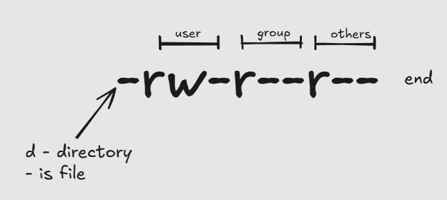
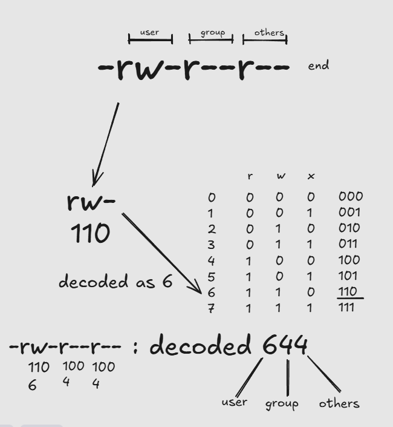

### Everything is a file

Starting from a simple:

ls -l

we may see something like:

```bash
-rw-r--r-- 1 usr usr    0 Jan 20 06:36 commands.txt  
drwxr-xr-x 2 usr usr 4096 Jan 20 07:25 test
```

Observe the very first character in each line:

- `-rw-r--r--` → starts with `-` → **regular file**
- `drwxr-xr-x` → starts with `d` → **directory**

But here’s the interesting part:

> A directory is also treated as a file in Linux.

In fact, Linux represents many things as files—not just text files, but also directories, devices, and system information.

---

### Files and Permissions

`ls -l` gives this type of o/p:

```bash
❯ ls -l
total 4
-rw-r--r-- 1 usr usr    0 Jan 20 06:36 commands.txt
drwxr-xr-x 2 usr usr 4096 Jan 20 07:25 test
```

`-rw-r--r--` - tells us about permissions

here, we make a pair of 3 from the `end`

for eg: in `-rw-r--r--` — `r--` , `r--` , `rw-`  are 3 pairs if seen from end and lastly at the start there is `-` 

the 3 pairs from end signify `others` , `group` and `user` permissions from end

if seen from start - `user`, `group` , `others`



`-` means no permission, `r` - read, `w` - write, `x` - execute permissions

### decoding file permissions with truth table



`For example, to keep read only we keep`  have 400

### change - chmod

so, if i do: 

```bash
chmod 400 commands.txt
```

 it changes permissions to `read only`
```bash
-r-------- 1 usr usr   28 Jan 20 08:36 commands.txt
```

---

### Where do commands like `ls` come from?

Commands like:
```bash
ls  
whoami
```

are actually **programs stored in the system**.

can find them in:
```bash
ls /bin  
ls /usr/bin
```
Linux uses an environment variable called:
```bash
echo $PATH
```
This tells the shell where to look for commands.

> If a command is not in `$PATH`, it won’t run unless given the full path.
---
### Example: Fixing “command not found” using $PATH**

Sometimes when you run a command, might see:
```bash
docker: command not found
```
This often means the command exists, but its location isn’t included in your $PATH.

Check your PATH:
```bash
echo $PATH
```
If the directory containing the command (e.g. /usr/local/bin) isn’t listed, the shell won’t find it.

can fix it temporarily:
```bash
export PATH=$PATH:/usr/local/bin
```
If the command works after this, the issue was your PATH.

To make it permanent, add the same line to your ~/.bashrc.

> In short: if a command doesn’t run, it might not be missing—it might just not be in your $PATH.

---

### Users and groups

Create and manage users:
```bash
sudo useradd -m <user-name>  
sudo userdel <user-name>
```
Create a group:
```bash
sudo groupadd devops
```
Important:

- Creating a user also creates a **group with the same name**
- Creating a group does **not** create a user
---
### Example: Running commands without sudo using groups

Sometimes you’ll notice a command only works with sudo:
```bash
docker run hello-world
```
It may fail with a permission error unless:
```bash
sudo docker run hello-world
```
This usually means your user doesn’t have the required permissions.

Check your groups:
```bash
groups
```

If you’re not part of the required group (e.g. docker), can add yourself:
```bash
sudo usermod -aG docker $USER
```
After logging out and back in, try again—no sudo needed.

> In short: if a command needs sudo, it might be a permission issue—you may just need to be added to the right group.

---

### Viewing System Users and Groups
```bash
cat /etc/passwd  
cat /etc/group
```
These files store:

- user information
- group information

---

### Adding Users to Groups
```bash
sudo usermod -aG <group-name> <user-name>
```


### Why Groups Matter (Practical Use)

Imagine you have a project folder that multiple developers need access to.

Instead of giving permissions one by one:

1. Create a group (e.g., `devops`)
2. Add users to the group
3. Assign permissions to the group

> Now, anyone added to the group automatically gets access.

This is especially useful for:

- team projects
- shared directories
- role-based access (admin, developer, tester)


---

### Processes in Shell Scripting

Processes are heavily used in shell scripting to run tasks in the background and manage execution.

For example:
```bash
sleep 10 &
```
This runs the process in the background, so the script can continue executing other commands.

You can also capture the process ID:
```bash
sleep 10 &  
pid=$!
```
Now you can control it later:
```bash
kill $pid
```
---

### Waiting for processes

Sometimes you want a script to wait for a background task:
```bash
wait $pid
```
---

In short
> Processes allow scripts to run tasks in parallel, manage long-running jobs, and control execution flow.